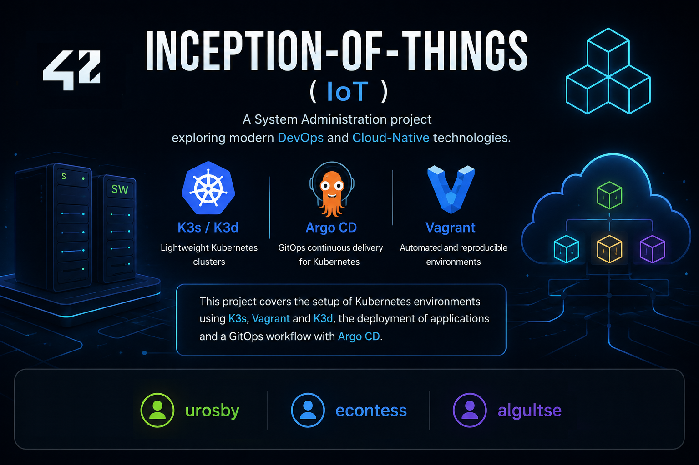
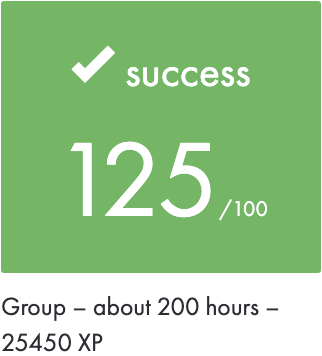
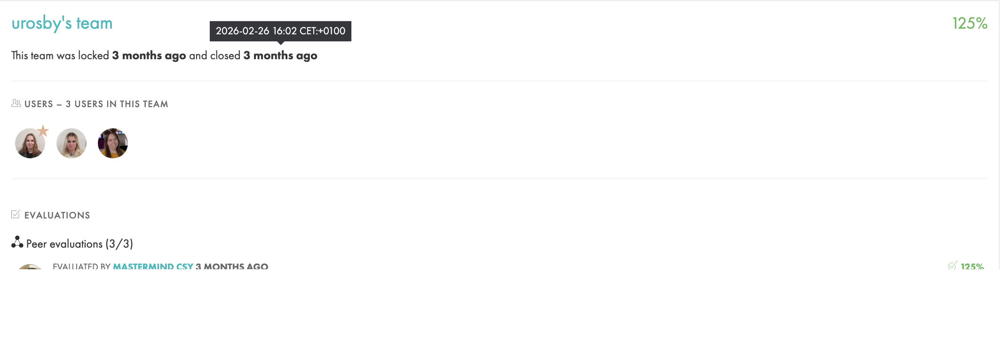
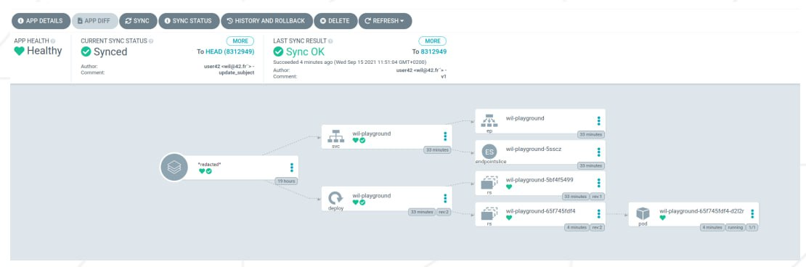

|           Grade          |                           |
|:------------------------:|:-------------------------:|
|  |  |
	

<br>

---

<details>
<summary>🇬🇧 ENGLISH VERSION</summary>

## Preamble
This <a href="subject/IoT.en.subject.pdf">project</a> was developed inside virtual machines as required by the subject.
The infrastructure was intentionally kept lightweight in order to better understand `Kubernetes` internals without using large production distributions.

## Overview
This project is an introduction to `Kubernetes` through a lightweight infrastructure built with:
- `K3s`
- `K3d`
- `Vagrant`
- `Docker`
- `Argo CD`
- `GitOps`

The goal of the project is to progressively build a small Kubernetes ecosystem:
- deploy and manage clusters,
- configure networking and ingress,
- orchestrate applications,
- automate deployments with Argo CD,
- understand GitOps workflows.

#### Part	Description
<details>
<summary>Part 1 — K3s & Vagrant</summary>

The first part builds a minimal Kubernetes cluster using two virtual machines. 

#### Infrastructure
  | Machine | Role       | IP             |
  |:-------:|:----------:|:--------------:|
  | loginS  | loginS     | 192.168.56.110 |
  | loginSW | K3s Worker | 192.168.56.111 |

**Features**
- Automated VM provisioning with Vagrant
- Passwordless SSH access
- Lightweight Kubernetes cluster using K3s
- Controller / Worker architecture
- Automated setup scripts

Launch cluster
```bash
cd p1
vagrant up
```
Connect to machines
```bash
vagrant ssh loginS
vagrant ssh loginSW
```
Verify cluster
```bash
kubectl get nodes -o wide
```
</details>

<details>
<summary>Part 2 — K3s & Applications</summary>

This part introduces:
- Deployments
- Services
- Replicas
- Ingress routing
- Host-based traffic redirection
Three applications are deployed inside the cluster.

**Applications**
  | Host     | Application |
  |:--------:|:-----------:|
  | app1.com | app1        |
  | app2.com | app2        |
  | default  | app3        |
app2 runs with multiple replicas.

Deploy infrastructure
```bash
cd p2
vagrant up
```
Verify resources
```bash
kubectl get all
```
Verify ingress
```bash
kubectl get ingress
```
Test routing
```bash
curl -H "Host: app1.com" http://192.168.56.110
curl -H "Host: app2.com" http://192.168.56.110
curl http://192.168.56.110
```
</details>

<details>
<summary>Part 3 — K3d & Argo CD + GitOps</summary>

The final mandatory part introduces:
- K3d
- Docker
- Argo CD
- GitOps
- Continuous deployment workflows
A local Kubernetes cluster is created with K3d. Argo CD continuously synchronizes Kubernetes manifests from a GitHub repository.

**Namespaces**
  | Namespace | Purpose                |
  |:---------:|:----------------------:|
  | argocd    | Argo CD services       |
  | dev       | Application deployment |

Create cluster
```bash
cd p3
make
```
or manually:
```bash
./scripts/create_cluster.sh
```

Install Argo CD
```bash
./scripts/install_argocd.sh
```
Configure application
```bash
./scripts/configure_app.sh
```
Verify namespaces
```bash
kubectl get ns
```
Verify application
```bash
kubectl get pods -n dev
```

**GitOps Workflow**
```sql
GitHub Repository
        │
        ▼
    Argo CD
        │
        ▼
 Kubernetes Cluster
        │
        ▼
 Application Sync
```
When the deployment file is updated inside GitHub:
```bash
image: wil42/playground:v1
```
and changed to:
```bash
image: wil42/playground:v2
```
Argo CD automatically synchronizes the cluster and redeploys the application.

**Verify deployed version**
```bash
curl http://localhost:8888
```
Expected outputs:
```json
{"status":"ok","message":"v1"}
```
or
```json
{"status":"ok","message":"v2"}
```
</details>

<details>
<summary>Bonus — GitLab Integration</summary>

The bonus part replaces GitHub with a self-hosted GitLab instance.
Features
- Local GitLab deployment
- Dedicated gitlab namespace
- Argo CD integration with GitLab repositories
- Full GitOps workflow using local infrastructure

Bonus scripts
```bash
bonus/scripts/install_gitlab.sh
bonus/scripts/configure_gitlab.sh
```
</details>



## Launch program
- Part 1
```bash
make
make clean
make fclean
```
- Part 2
```bash
make
make clean
```
- Part 3
```bash
make
make clean
```
- Bonus
```bash
make
make clean
```
</details>

---

<details>
<summary>🇫🇷 FRENCH VERSION</summary>

## Préambule
Ce <a href="subject/IoT.en.subject.pdf">projet</a> a été développé dans des machines virtuelles comme l'exigeait le sujet.
L'infrastructure a été intentionnellement gardée légère afin de mieux comprendre le fonctionnement interne de `Kubernetes` sans utiliser de lourdes distributions de production.

## Aperçu
Ce projet est une introduction à `Kubernetes` à travers une infrastructure légère construite avec :
- `K3s`
- `K3d`
- `Vagrant`
- `Docker`
- `Argo CD`
- `GitOps`

Le but du projet est de construire progressivement un petit écosystème Kubernetes :
- déployer et gérer des clusters,
- configurer le réseau et l'ingress,
- orchestrer des applications,
- automatiser les déploiements avec Argo CD,
- comprendre les flux de travail GitOps.

#### Description des parties
<details>
<summary>Partie 1 — K3s & Vagrant</summary>

La première partie construit un cluster Kubernetes minimal en utilisant deux machines virtuelles. 

#### Infrastructure
  | Machine | Rôle       | IP             |
  |:-------:|:----------:|:--------------:|
  | loginS  | loginS     | 192.168.56.110 |
  | loginSW | K3s Worker | 192.168.56.111 |

**Fonctionnalités**
- Provisionnement automatisé de VM avec Vagrant
- Accès SSH sans mot de passe
- Cluster Kubernetes léger utilisant K3s
- Architecture Contrôleur / Worker
- Scripts d'installation automatisés

Lancer le cluster
```bash
cd p1
vagrant up
```
Se connecter aux machines
```bash
vagrant ssh loginS
vagrant ssh loginSW
```
Vérifier le cluster
```bash
kubectl get nodes -o wide
```
</details>

<details>
<summary>Part 2 — K3s & Applications</summary>

Cette partie introduit :
- Les Déploiements (Deployments)
- Les Services
- Les Réplicas
- Le routage Ingress
- La redirection de trafic basée sur l'hôte
Trois applications sont déployées dans le cluster.

**Applications**
  | Hôte     | Application |
  |:--------:|:-----------:|
  | app1.com | app1        |
  | app2.com | app2        |
  | default  | app3        |
app2 s'exécute avec plusieurs réplicas.

Déployer l'infrastructure
```bash
cd p2
vagrant up
```
Vérifier les ressources
```bash
kubectl get all
```
Vérifier l'ingress
```bash
kubectl get ingress
```
Tester le routage
```bash
curl -H "Host: app1.com" http://192.168.56.110
curl -H "Host: app2.com" http://192.168.56.110
curl http://192.168.56.110
```
</details>

<details>
<summary>Part 3 — K3d & Argo CD + GitOps</summary>

La dernière partie obligatoire introduit :
- K3d
- Docker
- Argo CD
- GitOps
- Les flux de déploiement continu
Un cluster Kubernetes local est créé avec K3d. Argo CD synchronise en continu les manifestes Kubernetes depuis un dépôt GitHub.


**Namespaces**
  | Espace de noms | Objectif                  |
  |:--------------:|:-------------------------:|
  | argocd         | Services Argo CD          |
  | dev            | Déploiement d'application |

Créer le cluster
```bash
cd p3
make
```
ou manuellement :
```bash
./scripts/create_cluster.sh
```

Installer Argo CD
```bash
./scripts/install_argocd.sh
```
Configurer l'application
```bash
./scripts/configure_app.sh
```
Vérifier les espaces de noms
```bash
kubectl get ns
```
Vérifier l'application
```bash
kubectl get pods -n dev
```

**Flux de travail GitOpsw**
```sql
   Dépôt GitHub
        │
        ▼
    Argo CD
        │
        ▼
 Kubernetes Cluster
        │
        ▼
 Application Sync
```
Lorsque le fichier de déploiement est mis à jour dans GitHub:
```bash
image: wil42/playground:v1
```
et remplacé par :
```bash
image: wil42/playground:v2
```
Argo CD synchronise automatiquement le cluster et redéploie l'application.

**Vérifier la version déployée**
```bash
curl http://localhost:8888
```
Sorties attendues :
```json
{"status":"ok","message":"v1"}
```
ou
```json
{"status":"ok","message":"v2"}
```
</details>

<details>
<summary>Bonus — GitLab Integration</summary>

La partie bonus remplace GitHub par une instance GitLab auto-hébergée.
Fonctionnalités
- Déploiement GitLab local
- Espace de noms dédié gitlab
- Intégration d'Argo CD avec les dépôts GitLab
- Flux de travail GitOps complet utilisant une infrastructure locale

Scripts bonus
```bash
bonus/scripts/install_gitlab.sh
bonus/scripts/configure_gitlab.sh
```
</details>


## Launch program
- Part 1
```bash
make
make clean
make fclean
```
- Part 2
```bash
make
make clean
```
- Part 3
```bash
make
make clean
```
- Bonus
```bash
make
make clean
```
</details>

---

<details>
<summary>🇷🇺 RUSSIAN VERSION</summary>

## Преамбула
Этот <a href="subject/IoT.en.subject.pdf">проект</a> был разработан внутри виртуальных машин в соответствии с требованиями задания.
Инфраструктура намеренно поддерживалась легковесной, чтобы лучше понять внутреннее устройство Kubernetes без использования крупных production-дистрибутивов.

## Обзор
Этот проект представляет собой введение в Kubernetes через легковесную инфраструктуру, созданную с помощью:
- `K3s`
- `K3d`
- `Vagrant`
- `Docker`
- `Argo CD`
- `GitOps`

Цель проекта — постепенно построить небольшую экосистему Kubernetes:
- развертывание и управление кластерами,
- настройка сети и ingress,
- оркестрация приложений,
- автоматизация развертываний с помощью Argo CD,
- понимание рабочих процессов GitOps.

#### Описание частей
<details>
<summary>Part 1 — K3s & Vagrant</summary>
В первой части создается минимальный кластер Kubernetes с использованием двух виртуальных машин.

#### Инфраструктура
  | Машина  | Роль       | IP             |
  |:-------:|:----------:|:--------------:|
  | loginS  | loginS     | 192.168.56.110 |
  | loginSW | K3s Worker | 192.168.56.111 |

**Особенности**
- Автоматизированное развертывание ВМ с помощью Vagrant
- SSH-доступ без пароля
- Легковесный кластер Kubernetes с использованием K3s
- Архитектура Controller / Worker
- Автоматизированные скрипты установки

Запуск кластера
```bash
cd p1
vagrant up
```
Подключение к машинам
```bash
vagrant ssh loginS
vagrant ssh loginSW
```
Проверка кластера
```bash
kubectl get nodes -o wide
```
</details>

<details>
<summary>Part 2 — K3s & Applications</summary>

В этой части представлены:
- Развертывания (Deployments)
- Сервисы (Services)
- Реплики (Replicas)
- Маршрутизация Ingress
- Перенаправление трафика на основе хоста (Host-based routing)
Внутри кластера разворачиваются три приложения.

**Приложения**
  | Хост     | Приложение  |
  |:--------:|:-----------:|
  | app1.com | app1        |
  | app2.com | app2        |
  | default  | app3        |
app2 работает с несколькими репликами.

Развертывание инфраструктуры
```bash
cd p2
vagrant up
```
Проверка ресурсов
```bash
kubectl get all
```
Проверка ingress
```bash
kubectl get ingress
```
Проверка маршрутизации
```bash
curl -H "Host: app1.com" http://192.168.56.110
curl -H "Host: app2.com" http://192.168.56.110
curl http://192.168.56.110
```
</details>

<details>
<summary>Part 3 — K3d & Argo CD + GitOps</summary>

Последняя обязательная часть включает:
- K3d
- Docker
- Argo CD
- GitOps
- Рабочие процессы непрерывного развертывания
Локальный кластер Kubernetes создается с помощью K3d. Argo CD непрерывно синхронизирует манифесты Kubernetes из репозитория GitHub.

**Namespaces**
  | Пространства имен | Назначение               |
  |:-----------------:|:------------------------:|
  | argocd            | Сервисы Argo CD          |
  | dev               | Развертывание приложения |

Создание кластера
```bash
cd p3
make
```
или вручную:
```bash
./scripts/create_cluster.sh
```

Установка Argo CD
```bash
./scripts/install_argocd.sh
```
Настройка приложения
```bash
./scripts/configure_app.sh
```
Проверка пространств имен
```bash
kubectl get ns
```
Проверка приложения
```bash
kubectl get pods -n dev
```

**Рабочий процесс GitOps**
```sql
Репозиторий GitHub
        │
        ▼
    Argo CD
        │
        ▼
 Кластер Kubernetes
        │
        ▼
  Синхр. приложения
```
Когда файл развертывания обновляется в GitHub с:
```bash
image: wil42/playground:v1
```
на:
```bash
image: wil42/playground:v2
```
Argo CD автоматически синхронизирует кластер и заново разворачивает приложение.

**Проверка развернутой версии**
```bash
curl http://localhost:8888
```
Ожидаемый вывод:
```json
{"status":"ok","message":"v1"}
```
или
```json
{"status":"ok","message":"v2"}
```
</details>

<details>
<summary>Bonus — GitLab Integration</summary>

Бонусная часть заменяет GitHub на self-hosted экземпляр GitLab.
Особенности
- Локальное развертывание GitLab
- Выделенное пространство имен gitlab
- Интеграция Argo CD с репозиториями GitLab
- Полноценный рабочий процесс GitOps с использованием локальной инфраструктуры

Бонусные скрипты
```bash
bonus/scripts/install_gitlab.sh
bonus/scripts/configure_gitlab.sh
```
</details>


## Запуск программы
- Часть 1
```bash
make
make clean
make fclean
```
- Часть 2
```bash
make
make clean
```
- Часть 3
```bash
make
make clean
```
- Бонус
```bash
make
make clean
```
</details>

--- 

<br>

# Inception-of-Things
- Kubernetes fundamentals
- Cluster orchestration
- Infrastructure automation
- VM provisioning with Vagrant
- Networking and ingress management
- GitOps principles
- Continuous deployment workflows
- Container orchestration with K3s/K3d
- Argo CD synchronization

<details>
<summary>Architecture</summary>

```sql
.
├── p1/
│   ├── Vagrantfile
│   ├── scripts/
│   │   ├── server.sh
│   │   ├── worker.sh
│   │   ├── setup-host.sh
│   │   └── test.sh
│   └── confs/
│       └── config.yaml
│
├── p2/
│   ├── Vagrantfile
│   ├── confs/
│   │   ├── app1.yaml
│   │   ├── app2.yaml
│   │   ├── app3.yaml
│   │   └── ingress.yaml
│   └── scripts/
│       ├── setup.sh
│       └── test.sh
│
├── p3/
│   ├── confs/
│   │   ├── application.yaml
│   │   └── app/
│   │       └── deployment.yaml
│   └── scripts/
│       ├── create_cluster.sh
│       ├── install_argocd.sh
│       ├── configure_app.sh
│       └── setup_host.sh
│
└── bonus/
    ├── confs/
    └── scripts/
```
</details>

---

## Authors
Kubernetes introduction · K3s & K3d administration · Argo CD and GitOps concepts · Infrastructure automation

- [urosby](https://github.com/KarinaLogvina)
- [econtess](https://github.com/eddard-contessa)
- [algultse](https://github.com/N0fish)

> This project was developed as a team collaboration at Ecole 42 in February 2026.